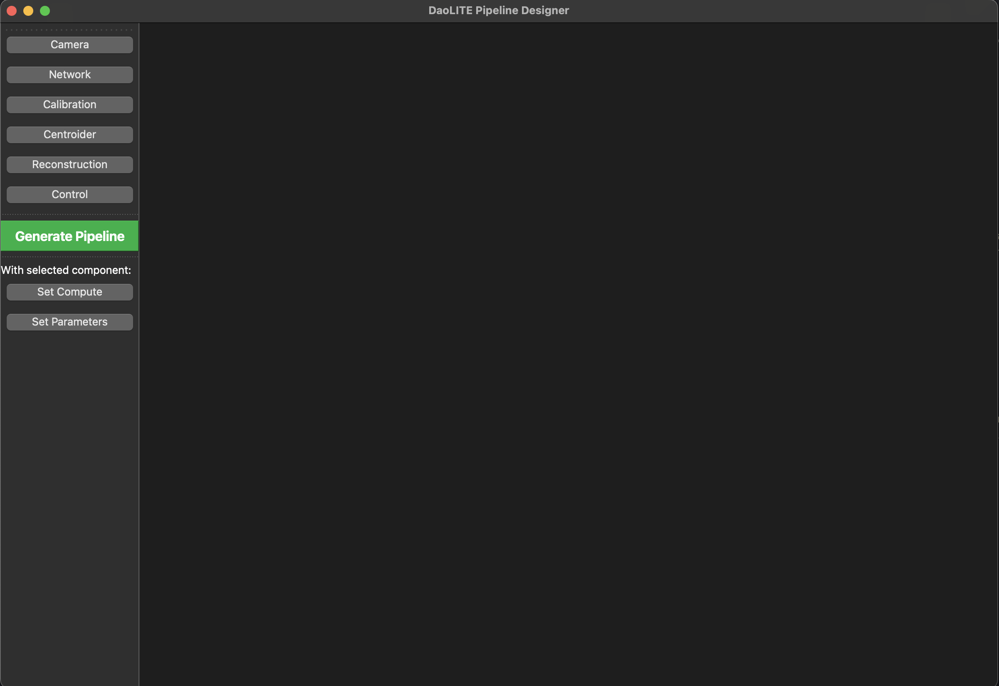
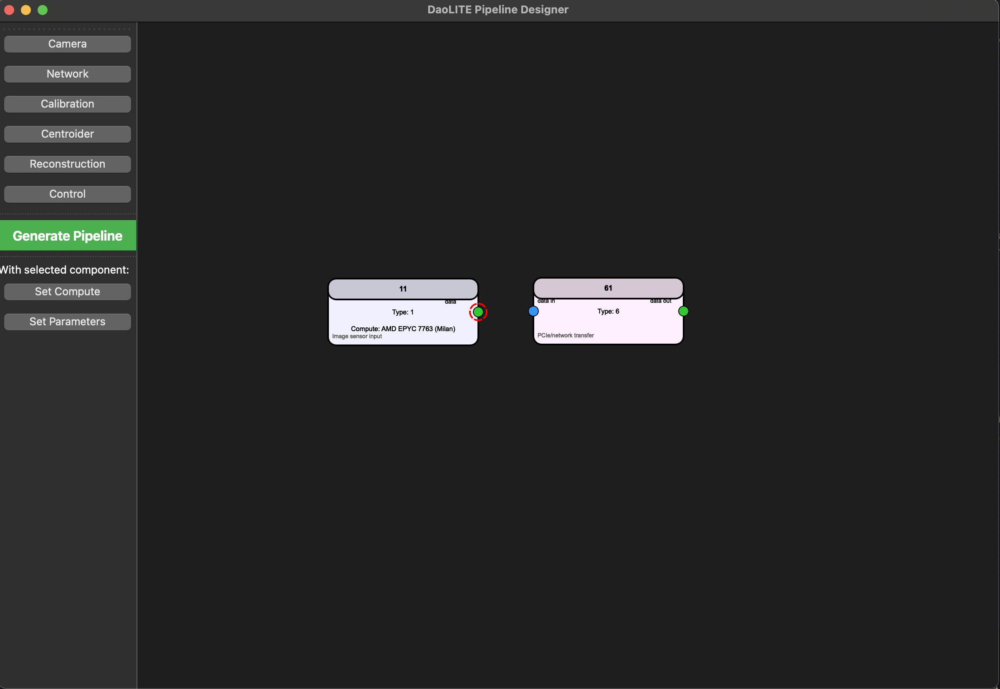
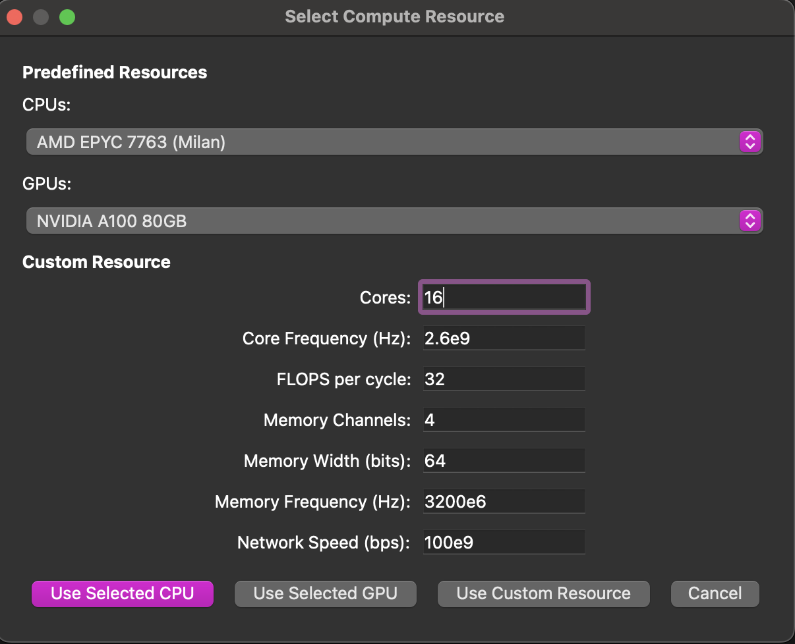
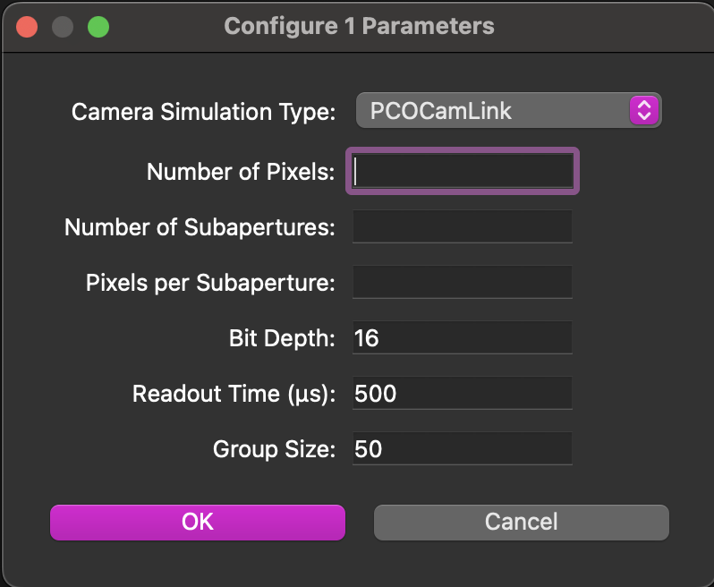
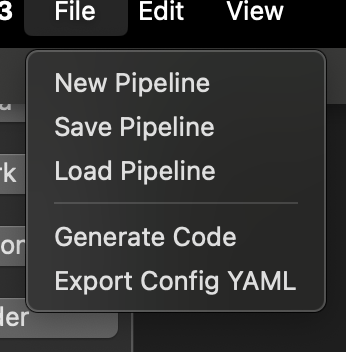

.. _pipeline_designer:

Pipeline Designer GUI
=====================

.. warning::
   **EXPERIMENTAL FEATURE**
   
   The Pipeline Designer GUI is currently in experimental development phase and may be unstable. 
   Users may experience crashes or unexpected behavior. Use with caution and save your work frequently.
   
   For production pipelines, we recommend using the JSON pipeline format directly or the 
   programmatic API until the GUI reaches a stable release.

Overview
--------

The Pipeline Designer is a graphical application for creating and editing daolite AO pipelines. It is especially useful for designing complex, multi-node, or networked AO systems.

Features
--------
- Drag-and-drop interface for adding pipeline components
- Visual editing of component parameters and connections
- Support for network and multi-compute node configurations
- Export pipelines to JSON for use with the JSON pipeline runner

Usage
-----

The GUI can be launched via the Pipeline Designer tool:

.. code-block:: bash

    python pipeline_designer.py

This will open the graphical interface for pipeline design.

Detailed Pipeline Designer GUI Documentation
--------------------------------------------

The daolite Pipeline Designer provides a powerful visual interface for constructing, configuring, and exporting Adaptive Optics (AO) pipelines. Below is a detailed guide to its features and usage, including annotated screenshots.

Launching the GUI
~~~~~~~~~~~~~~~~~
After installing daolite, launch the GUI with:

.. code-block:: bash

    daolite-pipeline-designer

or, if running from source:

.. code-block:: bash

    python -m daolite.gui.pipeline_designer

Key Features
~~~~~~~~~~~~
- **Drag-and-drop AO pipeline components**: Camera, Network, Calibration, Centroider, Reconstruction, Control.
- **Visual connection of components**: Click or drag to connect, with visual feedback and automatic insertion of network/PCIe transfer blocks for CPU↔GPU links.
- **Component configuration**: Set compute resources (CPU, GPU, or custom) and parameters for each component.
- **Save/load pipeline designs**: Store and retrieve your pipeline as JSON files.
- **Generate Python code**: Export the designed pipeline as executable Python code.
- **Export configuration as YAML**: For use in simulations or deployments.
- **Zoom, pan, and reset view**: Flexible navigation of large pipelines.
- **Rename and delete components**: Full editing support.
- **Contextual help and About dialog**: Built-in guidance.

GUI Walkthrough with Screenshots
~~~~~~~~~~~~~~~~~~~~~~~~~~~~~~~~

   The main window of the daolite Pipeline Designer, showing the toolbar and empty canvas.

   Example of several AO pipeline components added to the canvas.

   Visual feedback when starting to connect two components (highlighted port).

.. figure:: images/connectionMade.png
   :alt: Connection made
   :width: 600

   Components successfully connected, showing the pipeline flow.

   Dialog for selecting or configuring compute resources (CPU, GPU, or custom) for a component.

   Dialog for editing parameters of a selected component.

   File dialog for saving or loading a pipeline design.

Typical Workflow
~~~~~~~~~~~~~~~~
1. **Add components**: Use the toolbar to add Camera, Network, Calibration, Centroider, Reconstruction, and Control blocks.
2. **Connect components**: Click or drag between ports to create connections. The GUI will automatically insert network/PCIe transfer blocks for CPU↔GPU links.
3. **Configure compute resources**: Select a component and click 'Set Compute' to assign a CPU, GPU, or custom resource.
4. **Set parameters**: Select a component and click 'Set Parameters' to edit its configuration.
5. **Save/load designs**: Use the File menu to save your pipeline as JSON or load an existing design.
6. **Generate code**: Click 'Generate Pipeline' to export the current design as Python code.
7. **Export YAML**: Use the File menu to export the configuration as a YAML file for simulation or deployment.

Operational Manual
------------------

This section provides a step-by-step operational guide for building, configuring, and exporting AO pipelines using the daolite Pipeline Designer GUI.

Launching the Pipeline Designer
~~~~~~~~~~~~~~~~~~~~~~~~~~~~~~~
After installing daolite, launch the GUI with:

.. code-block:: bash

    daolite-pipeline-designer

or, if running from source:

.. code-block:: bash

    python -m daolite.gui.pipeline_designer

Main Window Overview
~~~~~~~~~~~~~~~~~~~~
- The main window displays a large canvas for building your pipeline.
- The left toolbar contains buttons for adding AO components (Camera, Network, Calibration, Centroider, Reconstruction, Control).
- The menu bar provides options for file operations, editing, view controls, and help.

Building a Pipeline
~~~~~~~~~~~~~~~~~~~
**a. Adding Components**

- Click a component button (e.g., "Camera", "Centroider") in the toolbar.
- The component appears at the center of the canvas.
- Repeat to add all required components for your pipeline.

**b. Arranging Components**

- Drag components to arrange them spatially on the canvas for clarity.

**c. Connecting Components**

- Click on a port (small circle) of a component to start a connection.
- Click on a compatible port of another component to complete the connection.
- Alternatively, click and drag from one port to another.
- The GUI will highlight ports and show visual feedback during connection.
- If connecting a CPU-based component to a GPU-based component, a network/PCIe transfer block is automatically inserted.

Configuring Components
~~~~~~~~~~~~~~~~~~~~~~
**a. Set Compute Resource**

- Select a component by clicking it.
- Click "Set Compute" in the toolbar.
- In the dialog, choose a predefined CPU/GPU or enter custom resource parameters.
- Click the appropriate button to assign the resource.

**b. Set Parameters**

- With a component selected, click "Set Parameters" in the toolbar.
- Fill in or adjust the parameters in the dialog.
- Click OK to save.

**c. Rename or Delete Components**

- Select a component.
- Use the Edit menu to rename or delete the selected component.

Saving and Loading Pipelines
~~~~~~~~~~~~~~~~~~~~~~~~~~~~
- To save your pipeline design, go to File → Save Pipeline. Choose a location and filename (JSON format).
- To load a saved pipeline, go to File → Load Pipeline and select your JSON file.

Generating Code
~~~~~~~~~~~~~~~
- When your pipeline is complete, click "Generate Pipeline" in the toolbar or select File → Generate Code.
- Choose a filename and location to save the generated Python code.

Exporting Configuration
~~~~~~~~~~~~~~~~~~~~~~~
- To export the pipeline configuration as a YAML file, select File → Export Config &YAML.
- Choose a filename and location.

Navigating the Canvas
~~~~~~~~~~~~~~~~~~~~~
- Use the View menu to zoom in, zoom out, or reset the zoom.
- Drag the canvas to pan and view different areas.

Example Workflow
~~~~~~~~~~~~~~~~
1. **Add a Camera, Centroider, Reconstruction, and Control component.**
2. **Connect them in sequence:** Camera → Centroider → Reconstruction → Control.
3. **Configure compute resources** for each (e.g., assign GPU to Centroider and Reconstruction).
4. **Set parameters** for each component as needed.
5. **Save your pipeline** as a JSON file.
6. **Generate Python code** for your pipeline.
7. **Export the configuration** as YAML for simulation or deployment.

Troubleshooting
~~~~~~~~~~~~~~~
- If the ``daolite-pipeline-designer`` command is not found, ensure you have reinstalled daolite after updating the entry points and that your Python environment's bin directory is in your PATH.
- For issues with missing dependencies, check and install all requirements from ``requirements.txt``.
- For further help, use the Help → About menu in the GUI.

.. note:: The GUI is designed to be intuitive and user-friendly. If you encounter any issues, please refer to the help section or contact support.